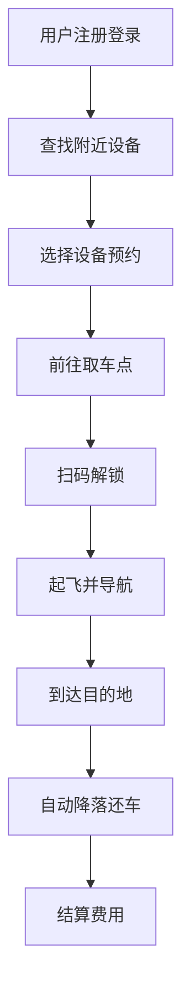

## 1. Product Overview
基于中国古代神话哪吒风火轮的设计灵感，打造一款未来感十足的单人悬浮出行工具——**风火轮X1**。通过磁悬浮技术实现低空飞行，融合传统美学与现代科技，为城市通勤提供高效、环保、炫酷的出行体验。
- 解决城市拥堵问题，提供快速点对点出行方案
- 目标用户：都市白领、科技爱好者、短途通勤人群
- 市场价值：填补个人低空出行市场空白，打造文化科技融合的创新产品

## 2. Core Features

### 2.1 User Roles
| Role | Registration Method | Core Permissions |
|------|---------------------|------------------|
| User | App注册/实名认证 | 预约使用、轨迹记录、故障上报 |
| Admin | 后台账号 | 设备管理、用户管理、数据分析 |

### 2.2 Feature Module
1. **用户端App**: 用户注册、设备预约、导航路线、飞行控制
2. **设备端系统**: 悬浮控制、动力系统、安全保障、状态监控
3. **后台管理**: 设备监控、用户管理、数据分析、故障处理

### 2.3 Page Details
| Page Name | Module Name | Feature description |
|-----------|-------------|---------------------|
| 首页 | 设备状态 | 显示附近可用设备、电量、位置 |
| 预约页 | 预约管理 | 预约设备、设置出发时间 |
| 控制页 | 飞行控制 | 起飞、加速、转向、降落控制 |
| 轨迹页 | 行程记录 | 历史行程、里程统计、费用明细 |
| 后台首页 | 监控面板 | 设备分布、在线状态、告警统计 |

## 3. Core Process
用户通过App查找附近可用的风火轮X1设备，进行预约后前往指定位置取车。通过手势或语音控制设备起飞，沿规划路线飞行到达目的地后自动降落并完成还车。

## 4. User Interface Design

### 4.1 Design Style
- **主色调**: 火焰橙(#FF6B00) + 科技蓝(#00D4FF)
- **辅助色**: 金色(#FFD700)用于品牌强调
- **按钮风格**: 圆润曲线，渐变色彩，带有发光效果
- **字体**: 无衬线字体，现代感十足
- **布局**: 卡片式设计，简洁大气
- **图标风格**: 科技感线性图标，融入传统元素

### 4.2 Page Design Overview
| Page Name | Module Name | UI Elements |
|-----------|-------------|-------------|
| 首页 | 设备卡片 | 圆形设备图标、电量进度条、距离显示、火焰动效 |
| 控制页 | 操控面板 | 虚拟摇杆、速度仪表盘、高度指示器 |
| 轨迹页 | 地图展示 | 3D地图、飞行轨迹动画、数据统计卡片 |

### 4.3 Responsiveness
- 移动端优先设计，适配iOS/Android
- 支持手势操作：滑动控制方向、捏合调整速度
- 语音控制功能："起飞"、"加速"、"左转"等指令

### 4.4 3D Scene Guidance
- **环境**: 未来都市夜景，霓虹灯效果
- **光照**: 冷色调主光源，配合暖色调氛围光
- **相机**: 跟随设备的第三视角，可切换第一人称
- **交互**: 设备起飞时的火焰特效、飞行尾迹效果
- **后处理**: 轻微运动模糊增强速度感

---

## 附录：产品概念说明

### 设计灵感来源
风火轮是哪吒的标志性法宝，传说由太乙真人所赐，脚踏双轮，能飞天遁地，日行万里。我们将这一神话元素与现代磁悬浮技术相结合，创造出这款具有中国文化特色的个人出行工具。

### 核心技术特点
1. **磁悬浮系统**: 采用高温超导材料实现无接触悬浮
2. **推进系统**: 离子推进器提供静音高效动力
3. **安全系统**: 多重传感器、自动避障、应急降落伞
4. **能源系统**: 石墨烯电池，快充30分钟续航100公里
