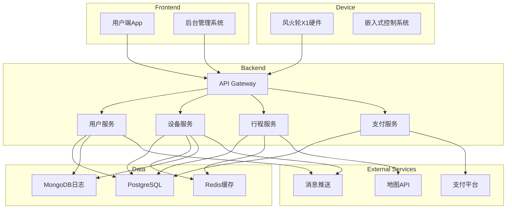
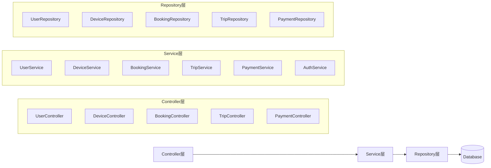
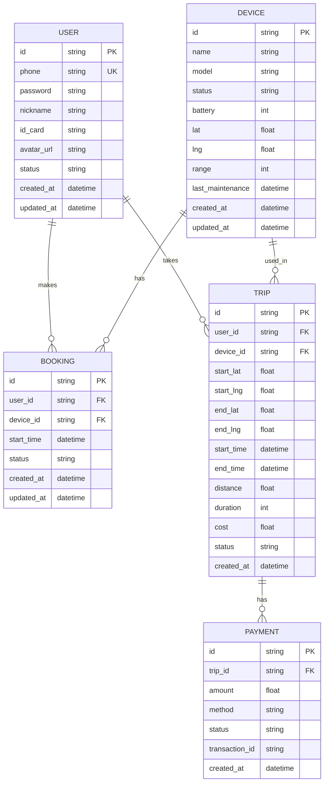

## 1. Architecture Design



## 2. Technology Description
- **Frontend**: React@18 + TypeScript + TailwindCSS@3 + Vite
- **Mobile App**: React Native / Flutter (跨平台)
- **Backend**: Node.js + Express@4 + TypeScript
- **Database**: PostgreSQL (主数据) + Redis (缓存) + MongoDB (日志)
- **Real-time**: WebSocket / MQTT (设备通信)
- **Cloud**: 阿里云/腾讯云
- **3D渲染**: Three.js (前端可视化)

## 3. Route Definitions

### 用户端App路由
| Route | Purpose |
|-------|---------|
| `/` | 首页 - 设备列表与预约 |
| `/booking` | 预约管理页 |
| `/control` | 飞行控制页 |
| `/trips` | 行程记录页 |
| `/profile` | 用户个人中心 |

### 后台管理路由
| Route | Purpose |
|-------|---------|
| `/admin/dashboard` | 数据监控面板 |
| `/admin/devices` | 设备管理 |
| `/admin/users` | 用户管理 |
| `/admin/analytics` | 数据分析 |
| `/admin/alerts` | 告警管理 |

### API路由
| Route | Method | Purpose |
|-------|--------|---------|
| `/api/users` | POST | 用户注册 |
| `/api/users/login` | POST | 用户登录 |
| `/api/devices` | GET | 获取设备列表 |
| `/api/devices/:id` | GET | 获取设备详情 |
| `/api/bookings` | POST | 创建预约 |
| `/api/trips` | POST | 开始行程 |
| `/api/trips/:id` | PUT | 更新行程状态 |
| `/api/payments` | POST | 创建支付 |

## 4. API Definitions

### 用户注册
```typescript
interface RegisterRequest {
  phone: string;
  password: string;
  nickname: string;
  idCard: string;
}

interface RegisterResponse {
  userId: string;
  token: string;
}
```

### 设备列表
```typescript
interface Device {
  id: string;
  name: string;
  status: 'available' | 'in_use' | 'charging' | 'maintenance';
  battery: number;
  location: { lat: number; lng: number };
  range: number;
}

interface GetDevicesResponse {
  devices: Device[];
}
```

### 创建预约
```typescript
interface CreateBookingRequest {
  deviceId: string;
  startTime: string;
}

interface CreateBookingResponse {
  bookingId: string;
  deviceId: string;
  status: 'pending' | 'confirmed' | 'cancelled';
}
```

### 行程操作
```typescript
interface Trip {
  id: string;
  userId: string;
  deviceId: string;
  startLocation: { lat: number; lng: number };
  endLocation: { lat: number; lng: number };
  startTime: string;
  endTime?: string;
  distance: number;
  duration: number;
  cost: number;
  status: 'in_progress' | 'completed' | 'cancelled';
}
```

## 5. Server Architecture Diagram



## 6. Data Model

### 6.1 Data Model Definition



### 6.2 Data Definition Language

```sql
CREATE TABLE users (
    id VARCHAR(36) PRIMARY KEY,
    phone VARCHAR(20) UNIQUE NOT NULL,
    password VARCHAR(255) NOT NULL,
    nickname VARCHAR(50),
    id_card VARCHAR(18),
    avatar_url VARCHAR(255),
    status VARCHAR(20) DEFAULT 'active',
    created_at TIMESTAMP DEFAULT CURRENT_TIMESTAMP,
    updated_at TIMESTAMP DEFAULT CURRENT_TIMESTAMP
);

CREATE TABLE devices (
    id VARCHAR(36) PRIMARY KEY,
    name VARCHAR(50),
    model VARCHAR(20),
    status VARCHAR(20) DEFAULT 'available',
    battery INT DEFAULT 100,
    lat FLOAT NOT NULL,
    lng FLOAT NOT NULL,
    range INT DEFAULT 100,
    last_maintenance TIMESTAMP,
    created_at TIMESTAMP DEFAULT CURRENT_TIMESTAMP,
    updated_at TIMESTAMP DEFAULT CURRENT_TIMESTAMP
);

CREATE TABLE bookings (
    id VARCHAR(36) PRIMARY KEY,
    user_id VARCHAR(36) REFERENCES users(id),
    device_id VARCHAR(36) REFERENCES devices(id),
    start_time TIMESTAMP NOT NULL,
    status VARCHAR(20) DEFAULT 'pending',
    created_at TIMESTAMP DEFAULT CURRENT_TIMESTAMP,
    updated_at TIMESTAMP DEFAULT CURRENT_TIMESTAMP
);

CREATE TABLE trips (
    id VARCHAR(36) PRIMARY KEY,
    user_id VARCHAR(36) REFERENCES users(id),
    device_id VARCHAR(36) REFERENCES devices(id),
    start_lat FLOAT NOT NULL,
    start_lng FLOAT NOT NULL,
    end_lat FLOAT,
    end_lng FLOAT,
    start_time TIMESTAMP NOT NULL,
    end_time TIMESTAMP,
    distance FLOAT,
    duration INT,
    cost FLOAT,
    status VARCHAR(20) DEFAULT 'in_progress',
    created_at TIMESTAMP DEFAULT CURRENT_TIMESTAMP
);

CREATE TABLE payments (
    id VARCHAR(36) PRIMARY KEY,
    trip_id VARCHAR(36) REFERENCES trips(id),
    amount FLOAT NOT NULL,
    method VARCHAR(20),
    status VARCHAR(20) DEFAULT 'pending',
    transaction_id VARCHAR(100),
    created_at TIMESTAMP DEFAULT CURRENT_TIMESTAMP
);

CREATE INDEX idx_devices_status ON devices(status);
CREATE INDEX idx_bookings_user ON bookings(user_id);
CREATE INDEX idx_trips_user ON trips(user_id);
CREATE INDEX idx_trips_status ON trips(status);
```

---

## 附录：设备端技术架构

### 硬件组件
| 组件 | 说明 |
|------|------|
| 磁悬浮模块 | 高温超导材料 + 永磁体 |
| 推进系统 | 离子推进器 x 4 |
| 电池系统 | 石墨烯电池组 |
| 传感器组 | GPS、陀螺仪、避障雷达 |
| 控制单元 | MCU + AI芯片 |
| 通信模块 | 5G + WiFi + BLE |

### 软件架构
```
┌─────────────────────────────────────┐
│         应用层 (Application)         │
│  飞行控制、导航、安全监控、用户交互    │
├─────────────────────────────────────┤
│         服务层 (Service)             │
│  通信服务、传感器服务、电源管理        │
├─────────────────────────────────────┤
│         驱动层 (Driver)              │
│  电机驱动、传感器驱动、通信驱动        │
├─────────────────────────────────────┤
│         硬件层 (Hardware)            │
│  MCU、传感器、执行器、通信模块         │
└─────────────────────────────────────┘
```
