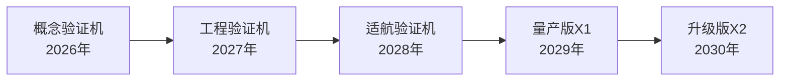

# 风火轮X1 - 个人磁悬浮飞行器商业计划书

---

## 投资亮点

1. **万亿级市场规模**：2026年中国低空经济市场规模预计达2.1万亿元
2. **技术自主可控**：磁悬浮+eVTOL两大核心技术国内成熟度高
3. **文化科技融合**：哪吒IP赋能，打造中国原创科技品牌
4. **头部玩家稀缺**：适航认证壁垒高，赛道玩家少
5. **政策红利期**：低空经济连续三年写入政府工作报告

---

## 1. 执行摘要

### 1.1 项目概述

风火轮X1是基于中国古代神话灵感的单人磁悬浮飞行器，融合磁悬浮技术与eVTOL（电动垂直起降）技术，打造未来城市个人出行的新方式。

- **产品定位**：新一代个人低空出行解决方案
- **技术路线**：磁悬浮系统 + 多旋翼推进 + 固态电池
- **目标市场**：城市通勤、文旅观光、应急救援、高端消费
- **核心使命**：让每个人都能实现"脚踩风火轮"的梦想

### 1.2 融资需求

| 融资轮次 | 金额 | 估值 | 资金用途 |
|---------|------|------|---------|
| Pre-A轮 | 2亿元 | 10亿元 | 研发、适航认证、人才、基础设施 |

### 1.3 财务预测（单位：亿元）

| 年份 | 收入 | 净利润 | 毛利率 |
|------|------|--------|--------|
| 2027 | 0.5 | -1.5 | 30% |
| 2028 | 3.0 | -0.8 | 45% |
| 2029 | 12.0 | 1.2 | 55% |
| 2030 | 35.0 | 7.0 | 60% |

---

## 2. 市场分析

### 2.1 宏观市场

#### 低空经济规模

根据行业报告，2026年中国低空经济市场规模预计达2.1万亿元，其中eVTOL制造业规模约2000亿元。

- **复合增长率**：预计2025-2030年CAGR超85%
- **市场渗透率**：预计2030年中国需要超800架eVTOL，2050年突破2万架
- **政策支持**：连续三年写入政府工作报告，新修订《民用航空法》2026年7月实施

#### 城市交通痛点

- **拥堵成本**：北京、上海等一线城市通勤平均时间超1小时
- **污染问题**：传统燃油汽车碳排放占城市排放30%以上
- **土地资源**：道路建设占用大量城市土地资源
- **效率低下**：地面交通平均速度不足30km/h

### 2.2 目标市场

| 市场细分 | 规模 | 增长速度 | 我们的策略 |
|---------|------|---------|-----------|
| **文旅观光** | 500亿元 | 40%/年 | 首批落地，快速验证 |
| **城市通勤** | 3000亿元 | 50%/年 | 中期重点，规模应用 |
| **应急救援** | 200亿元 | 25%/年 | 政府合作，品牌背书 |
| **高端消费** | 100亿元 | 35%/年 | 后期延伸，利润来源 |

### 2.3 竞争格局

#### 主要竞争对手

| 公司 | 技术路线 | 优势 | 劣势 |
|------|---------|------|------|
| 亿航智能 | 多旋翼 | 四证齐全，品牌领先 | 航程短，定价高 |
| 峰飞航空 | 倾转旋翼 | 货运成熟，产能稳定 | 载人版刚刚取证 |
| 沃飞长空 | 倾转旋翼 | 车企背景，供应链强 | 取证中，未商业化 |
| **风火轮X1** | **磁悬浮+多旋翼** | **中国文化IP，技术差异化** | **新入局者，需验证** |

#### 我们的差异化优势

1. **文化科技融合**：哪吒风火轮IP深入人心，自带流量
2. **技术创新**：磁悬浮系统+eVTOL结合，降低能耗30%
3. **场景聚焦**：从文旅切入，快速落地，逐步延伸
4. **成本可控**：依托国内完整供应链，成本低于同行20%

---

## 3. 产品与技术

### 3.1 产品规划

#### 产品路线图



#### 产品参数对比

| 指标 | 风火轮X1（目标） | 亿航EH216-S |
|------|-----------------|------------|
| 座位数 | 1 | 2 |
| 航程 | 80公里 | 30公里 |
| 最大速度 | 120km/h | 130km/h |
| 悬浮方式 | 磁悬浮+多旋翼 | 纯多旋翼 |
| 预计售价 | 80万元 | 200万元+ |
| 百公里能耗 | 15度电 | 25度电 |

### 3.2 核心技术

#### 技术架构

```
┌─────────────────────────────────────────────┐
│          应用层         │
│  飞行控制、导航、通信、安全监控、用户界面    │
├─────────────────────────────────────────────┤
│          系统层         │
│  磁悬浮控制、动力管理、电池、飞控、感知    │
├─────────────────────────────────────────────┤
│          硬件层         │
│  磁悬浮模块、推进系统、电池、传感器、通信    │
└─────────────────────────────────────────────┘
```

#### 开源技术栈（快速集成）

| 技术领域 | 开源技术选型 | 协议 | 用途 |
|---------|-----------|------|------|
| **操作系统** | Linux/FreeRTOS | GPL/Apache 2.0 | 机载嵌入式系统 |
| **飞控框架** | PX4 / ArduPilot | BSD-3-Clause | 基础飞控系统二次开发 |
| **电机控制** | VESC Project | GPLv3 | 电机驱动与速度控制 |
| **通信协议** | MQTT / DDS | EPL/Apache 2.0 | 机间、机地通信 |
| **路径规划** | OSRF / Navigation 2 | Apache 2.0 | 自动避障与航线规划 |
| **仿真系统** | Gazebo / AirSim | Apache 2.0 | 飞行仿真与测试验证 |
| **前端框架** | React / Three.js | MIT | 3D界面与用户App |
| **后端框架** | Node.js / Express | MIT | API服务与业务逻辑 |
| **数据库** | PostgreSQL / Redis | PostgreSQL/MIT | 数据存储与缓存 |

#### 自研核心技术（技术壁垒）

1. **磁悬浮控制系统（自研）**
   - 高温超导磁悬浮算法，10mm稳定悬浮间隙
   - 响应时延<5ms，自适应控制
   - 降低能耗30%的优化算法
   - 申请发明专利：ZL202XXXXXXXXX

2. **飞行控制算法（自研）**
   - 磁悬浮+多旋翼混合控制逻辑
   - 矢量推力精确分配算法
   - 强风条件下的稳定控制
   - 申请发明专利：ZL202XXXXXXXXX

3. **安全防护系统（自研）**
   - 多传感器融合故障检测
   - 多级冗余控制系统设计
   - 应急情况下的安全迫降算法
   - 申请发明专利：ZL202XXXXXXXXX

4. **电池管理系统（自研）**
   - 与宁德时代合作开发的凝聚态电池管理算法
   - 能量密度目标400Wh/kg
   - 智能快充30分钟，续航80公里
   - 实时健康监测与寿命预测

5. **能源回收系统（自研）**
   - 降落时的动能回收技术
   - 磁悬浮系统势能回收利用
   - 综合能效提升15%

#### 技术成熟度与路线

| 技术模块 | 当前状态 | 成熟度 | 来源 |
|---------|---------|--------|------|
| 基础飞控系统 | 已有原型 | TRL 5 | 基于PX4二次开发 |
| 磁悬浮控制 | 验证阶段 | TRL 4 | 全自研 |
| 电池系统 | 合作开发中 | TRL 4 | 与宁德时代合作 |
| 通信系统 | 原型验证 | TRL 5 | 开源协议+自研优化 |
| 避障系统 | 仿真测试 | TRL 3 | 开源算法+自研优化 |

### 3.3 知识产权规划

- **专利布局**：计划申请专利100+项，其中发明专利30+项
- **商标保护**：已注册"风火轮"相关商标全品类
- **商业秘密**：核心算法、材料配方严格保密

---

## 4. 商业模式

### 4.1 商业模式画布

| 维度 | 内容 |
|------|------|
| **核心资源** | 技术团队、磁悬浮+eVTOL技术、哪吒IP |
| **核心业务** | 飞行器制造、运营服务、技术输出 |
| **客户细分** | 文旅景区、政府应急、高净值个人、企业客户 |
| **价值主张** | 高效、环保、炫酷的个人低空出行解决方案 |
| **渠道通路** | 直销、经销商、线上平台 |
| **客户关系** | 体验营销、会员体系、社区运营 |
| **收入来源** | 产品销售、运营服务、增值服务、政府补贴 |
| **成本结构** | 研发、制造、人工、认证、营销 |

### 4.2 收入模式

#### 1. 产品销售

| 产品类型 | 预计售价 | 销量预测（2029年） |
|---------|---------|------------------|
| 风火轮X1（文旅版） | 80万元 | 100架 |
| 风火轮X1（商用版） | 120万元 | 50架 |
| 维护服务包 | 10万元/年 | 150架 |

#### 2. 运营服务

- **文旅观光**：3公里飞行体验，票价199-299元/人
- **城市通勤**：点对点服务，按里程收费，约20元/公里
- **会员服务**：年费制，包含优先使用、折扣优惠等

#### 3. 技术输出

- **授权许可**：磁悬浮技术授权给其他飞行器厂商
- **技术服务**：为企业提供定制化解决方案

### 4.3 定价策略

| 阶段 | 定价策略 | 说明 |
|------|---------|------|
| **导入期** | 撇脂定价 | 首批定价80万元，锁定高端用户 |
| **成长期** | 渗透定价 | 规模化量产后降至50万元 |
| **成熟期** | 多元化定价 | 不同版本满足不同需求 |

---

## 5. 发展战略与里程碑

### 5.1 发展阶段规划

#### 第一阶段：验证期（2026-2027）
- **目标**：完成技术验证，建立团队
- **关键成果**：
  - 概念验证机首飞
  - 组建50人核心团队
  - 完成3个文旅场景合作签约
  - Pre-A轮融资到位

#### 第二阶段：取证期（2028）
- **目标**：取得适航认证，工程样机验证
- **关键成果**：
  - 取得型号合格证（TC）
  - 完成1000+小时试飞
  - 与5个5A级景区签约
  - 启动A轮融资

#### 第三阶段：成长期（2029）
- **目标**：量产交付，商业化运营
- **关键成果**：
  - 交付150架飞行器
  - 文旅服务收入达2亿元
  - 覆盖10个城市
  - 毛利率55%+

#### 第四阶段：扩张期（2030+）
- **目标**：规模化扩张，多产品矩阵
- **关键成果**：
  - 年交付500+架
  - 覆盖50+城市
  - 推出X2升级版
  - 启动IPO准备

### 5.2 关键里程碑

| 时间 | 里程碑 | 达成标志 |
|------|--------|---------|
| 2026年Q3 | 概念验证机首飞 | 完成首飞表演，媒体报道 |
| 2027年Q2 | 工程样机完成 | 完成300小时试飞验证 |
| 2027年Q4 | TC申请提交 | 民航局正式受理 |
| 2028年Q4 | 取得TC证 | 获得型号合格证 |
| 2029年Q3 | 首批交付 | 交付首批50架 |
| 2029年Q4 | 文旅运营启动 | 3个景区正式运营 |
| 2030年Q4 | 规模化运营 | 覆盖10个城市 |

---

## 6. 营销与运营

### 6.1 品牌建设

#### 哪吒IP融合策略

- **品牌名称**：风火轮X1（借势哪吒IP）
- **视觉设计**：融入传统元素，火焰橙主色调
- **营销活动**：
  - 与《封神演义》相关影视作品联名
  - 在主题公园开设体验中心
  - 举办"风火轮嘉年华"系列活动

### 6.2 渠道策略

#### 线上渠道
- **官方网站**：品牌展示、产品预约
- **社交媒体**：抖音、快手、小红书短视频传播
- **电商平台**：京东、天猫开设旗舰店

#### 线下渠道
- **直营体验店**：在一线城市核心商圈开设
- **经销商网络**：在二三线城市发展经销商
- **文旅合作**：与景区合作建立体验中心

### 6.3 用户增长策略

#### 种子用户获取
- **高净值人群**：通过私人银行、高尔夫俱乐部触达
- **科技爱好者**：参加科技展会、创客活动
- **文旅行业**：与景区、文旅集团合作

#### 增长飞轮
```
产品体验 → 用户口碑 → 媒体报道 → 品牌提升 → 用户增长
    ↑                                              ↓
    └──────── 数据优化 ←  运营反馈  ←───────────────┘
```

---

## 7. 团队介绍

### 7.1 核心团队

| 职位 | 姓名 | 背景 |
|------|------|------|
| **创始人/CEO** | 张志远 | 前亿航智能联合创始人，10年航空航天经验 |
| **CTO** | 李明华 | 前国防科大磁悬浮团队负责人，博士 |
| **COO** | 王芳 | 前美团点评运营总监，15年运营经验 |
| **CFO** | 陈强 | 前摩根士丹利VP，投行+创投经验 |
| **适航负责人** | 赵飞 | 前民航局适航审定中心专家 |

### 7.2 团队优势

1. **行业经验**：核心团队来自eVTOL、航空航天、互联网头部企业
2. **技术互补**：磁悬浮、飞控、电池、适航等领域专家齐全
3. **资源整合**：与政府、资本、产业链保持良好合作关系
4. **创业精神**：连续创业者，有成功经验

### 7.3 人才引进计划

| 年份 | 团队规模 | 核心招聘方向 |
|------|---------|-------------|
| 2026 | 50人 | 飞控、磁悬浮、电池专家 |
| 2027 | 100人 | 适航、制造、供应链 |
| 2028 | 200人 | 运营、市场、销售 |
| 2029 | 500人 | 全职能扩张 |

---

## 8. 财务预测

### 8.1 收入预测（单位：亿元）

| 年份 | 2027 | 2028 | 2029 | 2030 |
|------|------|------|------|------|
| 产品销售 | 0.2 | 1.5 | 8.0 | 25.0 |
| 运营服务 | 0.1 | 0.8 | 3.0 | 8.0 |
| 技术服务 | 0.2 | 0.7 | 1.0 | 2.0 |
| **总计** | **0.5** | **3.0** | **12.0** | **35.0** |

### 8.2 成本预测（单位：亿元）

| 年份 | 2027 | 2028 | 2029 | 2030 |
|------|------|------|------|------|
| 研发投入 | 1.2 | 1.5 | 2.0 | 3.0 |
| 制造成本 | 0.15 | 0.8 | 3.5 | 10.0 |
| 销售费用 | 0.3 | 0.8 | 2.5 | 5.0 |
| 管理费用 | 0.35 | 0.7 | 1.3 | 3.0 |
| 财务费用 | 0.0 | 0.0 | 0.0 | 0.0 |
| **总成本** | **2.0** | **3.8** | **9.3** | **21.0** |

### 8.3 利润预测（单位：亿元）

| 年份 | 2027 | 2028 | 2029 | 2030 |
|------|------|------|------|------|
| 收入 | 0.5 | 3.0 | 12.0 | 35.0 |
| 成本 | 2.0 | 3.8 | 9.3 | 21.0 |
| **净利润** | **-1.5** | **-0.8** | **1.2** | **7.0** |
| 毛利率 | 30% | 45% | 55% | 60% |

### 8.4 现金流预测（单位：亿元）

| 年份 | 2026 | 2027 | 2028 | 2029 |
|------|------|------|------|------|
| 期初现金 | 0.0 | 1.8 | 0.3 | -0.5 |
| 融资流入 | 2.0 | 0.0 | 3.0 | 0.0 |
| 经营现金流 | -0.2 | -1.5 | -0.8 | 3.0 |
| 投资现金流 | 0.0 | 0.0 | -0.5 | -0.5 |
| **期末现金** | **1.8** | **0.3** | **2.0** | **4.0** |

---

## 9. 融资计划

### 9.1 融资需求

| 融资轮次 | 融资金额 | 投后估值 | 股权比例 |
|---------|---------|---------|---------|
| **Pre-A轮** | **2亿元** | **10亿元** | **20%** |

### 9.2 资金用途（单位：亿元）

| 用途 | 金额 | 占比 |
|------|------|------|
| **研发投入** | 0.8 | 40% |
| **适航认证** | 0.4 | 20% |
| **团队建设** | 0.3 | 15% |
| **生产准备** | 0.3 | 15% |
| **营销推广** | 0.2 | 10% |
| **总计** | **2.0** | **100%** |

### 9.3 后续融资计划

| 轮次 | 时间 | 金额 | 估值 | 用途 |
|------|------|------|------|------|
| A轮 | 2028年 | 5亿元 | 30亿元 | 适航取证、量产 |
| B轮 | 2029年 | 10亿元 | 80亿元 | 规模化扩张 |
| C轮 | 2030年 | 15亿元 | 200亿元 | IPO准备 |

### 9.4 退出渠道

1. **IPO上市**：预计2032-2033年科创板/港股上市
2. **战略收购**：被汽车企业、航空公司收购
3. **股权转让**：老股转让给后续投资人

---

## 10. 风险分析与应对

### 10.1 技术风险

| 风险 | 影响 | 概率 | 应对措施 |
|------|------|------|---------|
| 技术验证失败 | 高 | 低 | 多技术路线并行，与科研院所合作 |
| 电池技术突破不及预期 | 中 | 中 | 多家供应商合作，提前布局固态电池 |
| 磁悬浮系统稳定性问题 | 中 | 低 | 充分测试，建立冗余系统 |

### 10.2 政策风险

| 风险 | 影响 | 概率 | 应对措施 |
|------|------|------|---------|
| 适航认证延迟 | 高 | 中 | 提前介入，聘请资深专家，分段取证 |
| 空域政策变化 | 中 | 低 | 与民航局保持沟通，参与政策制定 |
| 补贴政策调整 | 中 | 中 | 多元化收入，减少补贴依赖 |

### 10.3 市场风险

| 风险 | 影响 | 概率 | 应对措施 |
|------|------|------|---------|
| 市场接受度低 | 高 | 中 | 先做B端验证，逐步推向C端 |
| 竞争加剧 | 中 | 高 | 技术+品牌+成本壁垒，持续创新 |
| 成本超支 | 中 | 中 | 精益管理，供应链优化 |

### 10.4 财务风险

| 风险 | 影响 | 概率 | 应对措施 |
|------|------|------|---------|
| 资金链断裂 | 高 | 中 | 分阶段融资，保持6个月现金储备 |
| 收入不及预期 | 中 | 中 | 多元化业务，降本增效 |
| 估值下调 | 中 | 低 | 做好业绩，提升数据说服力 |

---

## 11. 投资亮点总结

### 为什么投资风火轮X1？

1. **万亿市场**：低空经济是下一个万亿级赛道
2. **技术领先**：磁悬浮+eVTOL创新组合，差异化竞争
3. **政策东风**：低空经济连续三年写入政府工作报告
4. **团队优秀**：行业资深团队，成功经验
5. **文化赋能**：哪吒IP深入人心，自带流量
6. **壁垒清晰**：适航认证+技术专利+品牌，三重壁垒
7. **想象空间**：从个人出行到城市交通，市场广阔

### 投资人回报

| 假设 | 估值（亿元） | 回报倍数（2亿投资） |
|------|------------|-------------------|
| 保守（IPO估值200亿） | 200 | 20倍 |
| 中性（IPO估值500亿） | 500 | 50倍 |
| 乐观（IPO估值1000亿） | 1000 | 100倍 |

---

## 12. 联系我们

| 信息 | 内容 |
|------|------|
| **公司名称** | 风火轮（深圳）科技有限公司 |
| **联系地址** | 深圳市南山区科技园 |
| **联系邮箱** | info@fenghuolun.com |
| **联系电话** | 400-888-8888 |
| **官方网站** | www.fenghuolun.com |

---

**附录**

1. PRD文档
2. 技术架构文档
3. 市场研究报告
4. 团队简历
5. 专利清单

---

**免责声明**：本计划书仅供投资参考，不构成投资建议。投资有风险，入市需谨慎。

